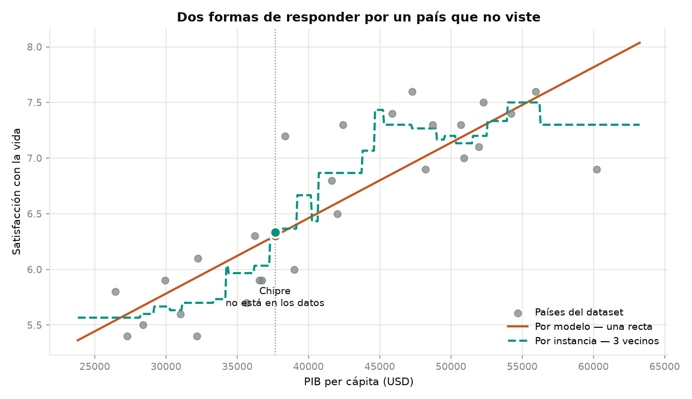

# Capítulo 1 — El panorama

*Géron, cap. 1 · dataset `lifesat`*

El capítulo es casi todo conceptual, pero tiene un dataset: **27 países con su PIB per
cápita y su satisfacción con la vida**, cruzando el índice de la OCDE con cifras del FMI.

```bash
make lifesat
```

Imprime los números de abajo, regenera `reports/lifesat.png` y vuelca
`web/public/data/ch01.json` — 2.4 KB con las 27 filas y los dos coeficientes de la
recta, que es todo lo que la demo del sitio necesita para reajustar ambos modelos en
el navegador. Que quepan es justamente lo que el capítulo enseña.

Existe para enseñar una sola cosa — que hay dos maneras de generalizar a un caso nuevo.



## Las dos formas de responder por un país que no viste

Ambos modelos predicen para **Chipre**, que no está en los datos:

| | Predicción | Qué guarda para hacerlo |
|---|---|---|
| Por modelo — una recta | **6.30** | 2 números: pendiente e intersección |
| Por instancia — 3 vecinos | **6.33** | Los 27 países completos, y los necesita todos |

Respuestas casi idénticas por caminos opuestos. La recta **resume** los datos y después
los descarta; el k-vecinos **no resume nada**, guarda todo y busca los más parecidos
cuando le preguntas.

En la gráfica se ve la diferencia: una línea suave contra una escalera. La escalera
cambia de valor cada vez que el vecindario de los tres más cercanos cambia de
composición.

**Por qué importa en la práctica:** el modelo por instancia carga con todos sus datos a
producción, y responde más lento cuanto más ha visto. Aquí son 27 filas y da igual; con
volúmenes reales deja de dar igual.

## Y de paso, el subajuste

La recta explica el **73%** de la variación. El 27% restante no es ruido de medición: es
que la felicidad de un país **no es una función de su riqueza**.

Ese es exactamente el subajuste que describe el capítulo — un modelo demasiado simple
para la estructura que hay en los datos. Se ve a simple vista en la gráfica: hay países
ricos por debajo de la recta y países modestos por encima, y ninguna recta puede
capturarlos a la vez.

---

**En el sitio:** [`/ch01`](https://ml.eliuth.dev/ch01) es el resumen del capítulo,
[`/ch01/lifesat`](https://ml.eliuth.dev/ch01/lifesat) el desarrollo de este dataset y
[`/ch01/lifesat/demo`](https://ml.eliuth.dev/ch01/lifesat/demo) la demo interactiva.

**Nota:** este capítulo no registra experimentos en MLflow. Son 27 filas y dos modelos de
una línea; medir su desempeño con validación cruzada sería ceremonia sin sustancia. El
dataset está aquí para ilustrar un concepto, no para construir nada.
