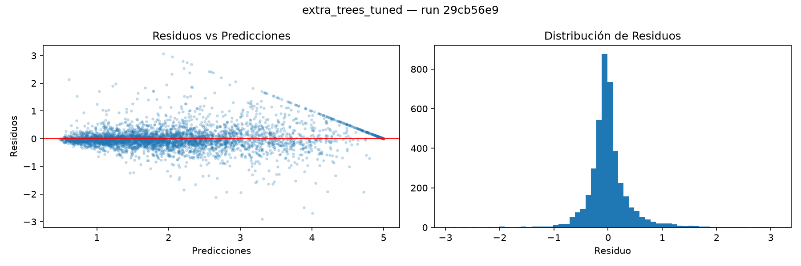

# Evaluación Final — extra_trees_tuned

**run_id:** `29cb56e91d824fdea6c555eeea9be4d0`

| Métrica | Valor |
|---------|-------|
| RMSE    | 0.4063 |
| MAE     | 0.2497 |
| R²      | 0.8767 |
| IC 95% del RMSE | [0.3844, 0.4271] |

> RMSE en unidades originales: USD 40,628 promedio de error por casa.
> Con 95% de confianza, el error real está entre USD 38,440
> y USD 42,705.

**Cómo leer el intervalo:** otro modelo solo es mejor de verdad si su RMSE queda
fuera de este rango. Si dos modelos tienen intervalos que se traslapan, la
diferencia entre ellos cabe dentro del ruido del muestreo y no se puede afirmar
que uno gane.

