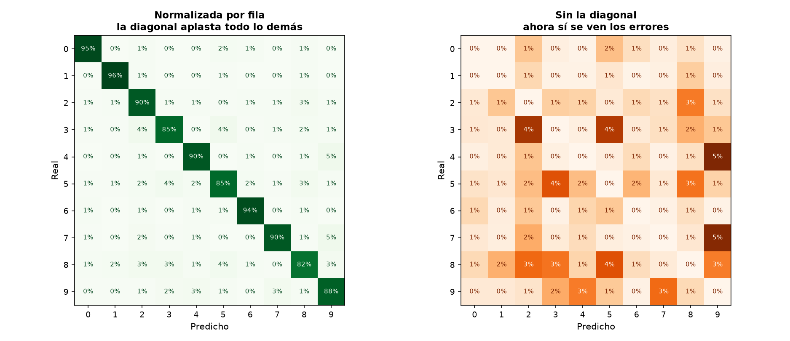
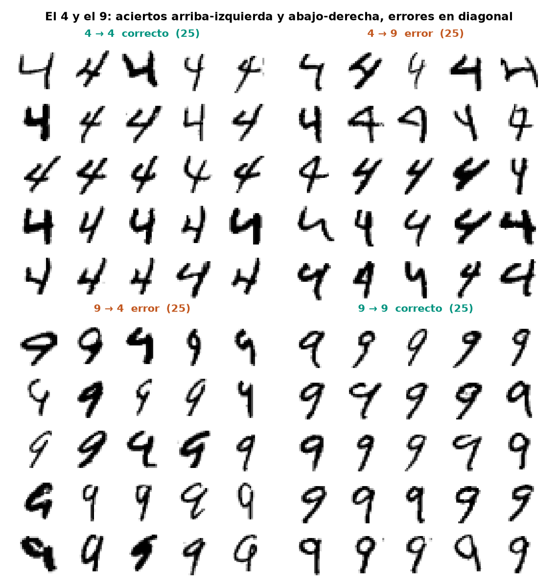
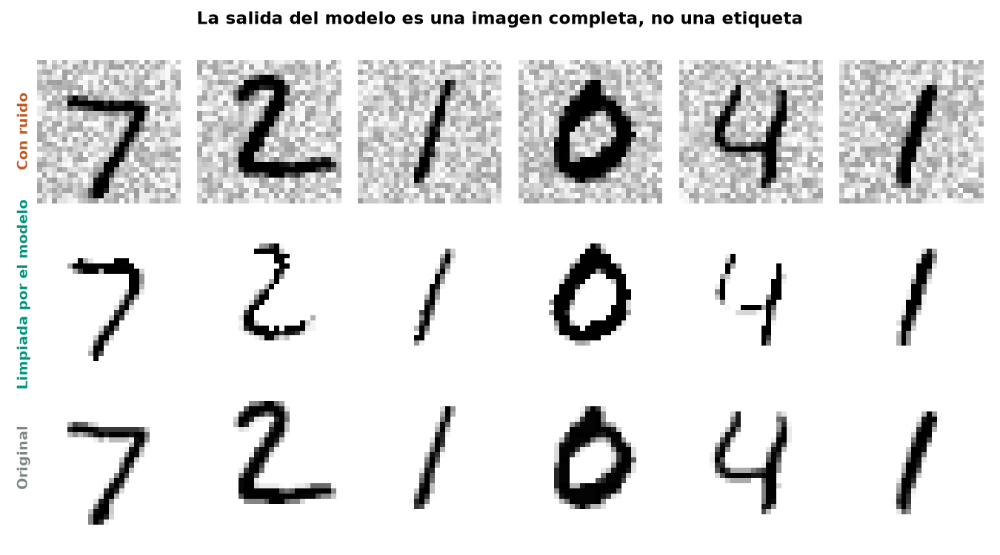

# Capítulo 3 — Clasificación

*Géron, cap. 3 · dataset MNIST*

70,000 dígitos escritos a mano. El objetivo del capítulo **no es clasificarlos**, es
aprender a medir un clasificador — que resulta bastante más resbaladizo que medir una
regresión.

```bash
make data        # descarga MNIST desde OpenML (14 MB)
make features    # partición canónica 60k/10k
make baseline    # detector binario + la trampa de la exactitud
make metrics     # umbral, curvas PR y ROC → reports/
make multiclass  # los 10 dígitos: OvR vs OvO
make errors      # matriz de confusión y qué confunde con qué
make multioutput # multietiqueta y quitar ruido de imágenes
make titanic     # ejercicio 3 — supervivencia
make spam        # ejercicio 4 — filtro de spam
make knn         # ejercicio 1 — k-vecinos afinado (>97%)
make augment     # ejercicio 2 — aumentar datos desplazando imágenes
```

---

## La trampa de la exactitud

El primer ejercicio es un detector de una sola cosa: *¿esta imagen es un 5?*

Solo el **9% de las imágenes son cincos**. Así que un modelo que responda "no es un 5"
a todo acierta el 91% de las veces sin haber mirado un solo píxel. `make baseline`
entrena ese modelo tonto a propósito para ponerlo al lado del real:

| | Exactitud |
|---|---|
| Clasificador real (SGD) | 0.9696 |
| Responder siempre «no es 5» | 0.9096 |

**Seis puntos** separan un modelo que aprendió de uno que no hizo nada. Ese es el
motivo por el que la exactitud no sirve cuando una clase es rara — y en la práctica
casi siempre lo es: el fraude, la enfermedad, la falla del equipo.

## Lo que sí distingue

```
                    predijo «no 5»   predijo «5»
    es «no 5»          53,470           1,109   ← falsos positivos
    es «5»                715           4,706
                        ↑ falsos negativos
```

| Métrica | Valor | Qué responde |
|---|---|---|
| Precisión | 0.809 | De lo que llamó 5, ¿cuánto era 5? |
| Exhaustividad | 0.868 | De todos los 5 que había, ¿cuántos encontró? |
| F1 | 0.838 | Media armónica — penaliza el desequilibrio entre ambas |

Todas se calculan con `cross_val_predict`: cada imagen la puntúa un modelo que no la
vio al entrenarse. Medirlas sobre el propio entrenamiento daría números inflados.

---

## El compromiso, y que no tiene solución técnica

Un clasificador no responde sí o no: calcula una puntuación y la compara contra un
umbral. Moverlo desplaza las dos métricas en direcciones opuestas.


Pedirle **90% de precisión** a este modelo cuesta caro:

| | |
|---|---|
| Umbral | +0.69 |
| Precisión | 0.900 |
| Exhaustividad | **0.789** |

Es decir: para equivocarse solo 1 de cada 10 veces que dice "es un 5", tiene que
dejar escapar **1 de cada 5 cincos**.


**Dónde pararse en esa curva no es una decisión técnica.** Un filtro de spam quiere
precisión — mandar un correo importante a la basura es peor que dejar pasar
publicidad. Un detector de tumores quiere exhaustividad — revisar de más es un susto,
pasar uno por alto es otra cosa. Mismo modelo, distinto punto de operación, según lo
que cueste equivocarse.

## Comparar clasificadores sin fijar un umbral


| Modelo | Área bajo la curva |
|---|---|
| Lineal (SGD) | 0.971 |
| Bosque aleatorio | **0.998** |

El área resume el desempeño en todos los umbrales a la vez, así que sirve para
comparar modelos antes de decidir dónde operar.

⚠️ **Cuidado con esta métrica cuando la clase positiva es rara.** La curva ROC usa la
proporción de falsos positivos, y con 54,000 negativos contra 5,400 positivos el
denominador es tan grande que la curva se ve optimista. Para clases desbalanceadas, la
curva de precisión contra exhaustividad cuenta la verdad más incómoda — y por eso
Géron recomienda preferirla en ese caso.

---

## Multiclase: quién monta qué por debajo

```bash
make multiclass
```

Muchos algoritmos son binarios de nacimiento. Para diez clases, scikit-learn los
envuelve — y elige la estrategia según el algoritmo:

| Modelo | n | Exactitud | Estrategia |
|---|---|---|---|
| Lineal (SGD) | 60,000 | 0.9097 | Uno contra todos — 10 clasificadores |
| Bosque aleatorio | 60,000 | **0.9646** | Nativamente multiclase |
| SVC | 10,000 | 0.9552 | Uno contra uno — 45 clasificadores |

**Por qué SVC usa 45 en vez de 10:** uno contra uno entrena un clasificador por cada
par de dígitos, y cada uno solo ve las imágenes de sus dos clases — unas 12,000 en vez
de 60,000. Para algoritmos que escalan mal con el tamaño sale ganando, aunque monte
cuatro veces más modelos.

⚠️ No confundir estrategias multiclase con ensambles: los 100 `estimators_` de un
bosque son sus árboles, no un clasificador por clase.

**Cuánto pesa escalar**, en el modelo lineal sobre 10,000 imágenes:

| | Exactitud |
|---|---|
| Píxeles crudos (0–255) | 0.8462 |
| Escalados a 0–1 | **0.8815** |

Tres puntos y medio por una división. En modelos lineales el escalado no es cosmético.

---

## Análisis de errores: qué arreglar, no cuánto fallas

```bash
make errors
```



La matriz cruda es inútil: la diagonal se lleva todo el color y los errores quedan
invisibles. Normalizada por fila y con la diagonal en cero, aparece el patrón.

| Confusión | Tasa |
|---|---|
| 4 → 9 | 5.14% |
| 7 → 9 | 5.02% |
| 3 → 2 | 4.48% |
| 3 → 5 | 4.34% |
| 8 → 5 | 3.69% |



**Y aquí está el valor real del ejercicio.** Mirando las imágenes que confundió: los 4
mal clasificados tienen la parte superior **cerrada**, y los 9 mal clasificados la
tienen **abierta**. El modelo no está siendo tonto — esos dígitos son genuinamente
ambiguos incluso para una persona.

Eso cambia qué se hace después. No es "entrena más": es que un modelo lineal ve píxeles
sueltos y no puede representar «tiene un lazo cerrado arriba», que es la diferencia
entre un 4 y un 9. La solución sale del capítulo 14 — redes convolucionales, que sí
capturan forma.

---

## Multietiqueta: varias respuestas a la vez

```bash
make multioutput
```

En vez de «¿cuál dígito?», dos preguntas binarias simultáneas sobre la misma imagen:
*¿es grande (≥7)?* y *¿es impar?*. Puede ser las dos, una, o ninguna. El caso real
típico es reconocimiento facial — en una foto con tres personas conocidas, la respuesta
correcta son tres etiquetas encendidas.

| | F1 |
|---|---|
| ¿Es grande? | **0.9416** |
| ¿Es impar? | 0.9664 |
| Macro (promedia por igual) | 0.9540 |
| Ponderado (pesa por frecuencia) | 0.9572 |

**«Es grande» salió más difícil, y no era lo esperado** — parece la pregunta más simple
de las dos. Ninguna de las dos corresponde a una forma visual: el modelo tiene que
reconocer el dígito y después responder, así que hereda las confusiones del análisis de
errores. Cuál sale peor depende de qué pares confunde y de qué lado de cada pregunta
caen.

## Multisalida: cuando la respuesta es una imagen



Llevado al extremo: entrenar con imágenes ruidosas como entrada y limpias como
objetivo. Son **784 salidas, cada una con 256 valores posibles**.

| Error medio por píxel | |
|---|---|
| Con ruido | 45.54 |
| Después del modelo | **15.15** |

Esto deja clara una frontera borrosa: quitar ruido de una imagen suena a regresión, no
a clasificación. La distinción no siempre es nítida — y el capítulo lo usa justo para
mostrar que las categorías del libro son herramientas, no compartimentos estancos.

Detalle de implementación: aquí **no** se escala la entrada. La salida son píxeles en
su escala original, y escalar solo la entrada las desalinearía.

---

---

## Ejercicio 3 — Titanic

```bash
make titanic
```

1,309 pasajeros con edades faltantes y columnas mezcladas. Vuelve toda la maquinaria
del capítulo 2 —imputar, escalar, codificar dentro del `Pipeline`— pero se juzga con
las métricas del 3.

| Modelo | Exactitud | Precisión | Exhaustividad |
|---|---|---|---|
| SVC | **0.8098** | 0.7795 | 0.7000 |
| Bosque | 0.7945 | 0.7538 | 0.6860 |
| Regresión logística | 0.7876 | 0.7372 | 0.6900 |

**Un error que costó once puntos.** La primera corrida daba 0.70 de exactitud, muy por
debajo de lo esperado para este dataset. La causa no era el modelo: **el archivo viene
ordenado por clase de pasaje**, así que sin barajar, el primer pliegue de la validación
cruzada era 100% primera clase y los dos últimos 100% tercera. El modelo se entrenaba
con un perfil de pasajero y se evaluaba con otro.

`StratifiedKFold` no lo detecta porque equilibra la **supervivencia**, no la clase.
Basta `shuffle=True` para pasar de 0.70 a 0.81.

Es la lección del capítulo 2 —la partición importa— reapareciendo con otra cara.

## Ejercicio 4 — Filtro de spam

```bash
make spam
```

3,000 correos reales del corpus de Apache SpamAssassin, con cabeceras, HTML y
codificaciones rotas. El trabajo está antes del modelo: preferir texto plano sobre
HTML, anteponer el asunto, y reemplazar URLs, correos y números por marcadores — que
aparezca *una* URL importa, cuál exactamente no.

| Modelo | Exactitud | Precisión | Exhaustividad |
|---|---|---|---|
| SVM lineal | **0.9900** | 0.9958 | **0.9440** |
| Regresión logística | 0.9720 | **1.0000** | 0.8320 |
| Naive Bayes | 0.9280 | 0.9931 | 0.5720 |

**Aquí la precisión pesa más que la exhaustividad**: mandar un correo legítimo a la
basura es mucho peor que dejar pasar publicidad.

Pero elegir *solo* por precisión también engaña. La regresión logística tiene precisión
perfecta —cero legítimos perdidos— a cambio de dejar pasar **84 spam**. El SVM lineal
pierde 2 legítimos y solo deja pasar 28. Cuál conviene depende de cuánto duele cada
error, y ninguna métrica sola lo responde.

Ajustando el umbral para 99% de precisión:

| | |
|---|---|
| Umbral | 0.273 |
| Precisión | 0.9915 |
| Exhaustividad | 0.9280 |

---

## Ejercicio 1 — k-vecinos afinado

```bash
make knn
```

k-vecinos no entrena: memoriza. Ajustar es guardar las 60,000 imágenes; el trabajo
ocurre al predecir. Búsqueda sobre `n_neighbors` y `weights`:

| | |
|---|---|
| Mejores parámetros | `n_neighbors=4, weights=distance` |
| Validación cruzada | 0.9704 |
| **Conjunto de prueba** | **0.9714** ✓ supera el 97% |

### ⚠️ Este script congeló una máquina de 16 GB

La primera versión pedía `n_jobs=-1` en los dos niveles a la vez:

```python
GridSearchCV(KNeighborsClassifier(n_jobs=-1), ..., n_jobs=-1)   # ✗
```

`GridSearchCV` paraleliza con **procesos**: cada uno recibe su copia del conjunto de
entrenamiento, y sklearn lo convierte a float64 — 376 MB por copia. Con 10 núcleos son
3.8 GB solo en datos, y encima cada proceso pedía otros diez hilos.

Tres correcciones, cada una medida sobre 20,000 imágenes:

| Cambio | Por qué |
|---|---|
| `n_jobs=1` en la búsqueda, `-1` en el modelo | k-vecinos paraleliza con **hilos** sobre memoria compartida: una sola copia |
| `working_memory` a 128 MB | El culpable oculto: por defecto son **1024 MB por hilo** para bloques de distancias |
| `float32` | Los píxeles van de 0 a 255; no necesitan float64 |

**Pico de memoria: 3.00 GB → 0.49 GB.** Y más rápido: 25.7s → 17.0s.

El error de método fue peor que el bug: la estimación de costo se midió con un
`KNeighborsClassifier` suelto y después se escribió el script con la versión anidada,
sin volver a medir.

## Ejercicio 2 — aumentar los datos

```bash
make augment                    # completo
python src/augment.py --check   # solo proyecta la memoria, no corre
```

Un 7 desplazado un píxel sigue siendo un 7 — pero para k-vecinos, que compara píxel
contra píxel, es una imagen distinta. Añadiendo las cuatro versiones desplazadas, el
conjunto pasa de 60,000 a **300,000** imágenes.

| | Exactitud |
|---|---|
| Sin aumentar | 0.9714 |
| Con aumento | **0.9763** |

Casi medio punto sin tocar el modelo ni los hiperparámetros. En visión por computadora
el aumento de datos suele rendir más que afinar.

Tras el incidente anterior, este script **proyecta el pico antes de reservar memoria** y
aborta si no cabe con holgura:

```
[augment] RAM total 16 GB · límite que me impongo 7.2 GB
  datos en float32        0.88 GB
  bloques de distancias   1.25 GB
  pico estimado           2.66 GB
[augment] ✓ cabe con holgura
```

Pico real medido en la corrida completa: **1.81 GB**. La proyección sobreestima ~2×,
que es el lado correcto para equivocarse.

---

## Capítulo completo

Las cuatro secciones del cuerpo y los cuatro ejercicios.

## Estructura

| Archivo | Fase |
|---|---|
| `src/data.py` | Descarga desde OpenML, guarda en `uint8` |
| `src/features.py` | Partición canónica 60k/10k, sin barajar |
| `src/baseline.py` | Detector binario, modelo tonto, matriz de confusión |
| `src/metrics.py` | Umbral, curvas PR y ROC |
| `src/multiclass.py` | Los 10 dígitos: OvR vs OvO, efecto del escalado |
| `src/errors.py` | Matriz de confusión 10×10 y montaje del peor par |
| `src/multioutput.py` | Multietiqueta y quitar ruido de imágenes |
| `src/titanic.py` | Ejercicio 3 — supervivencia, datos tabulares mixtos |
| `src/spam.py` | Ejercicio 4 — filtro de spam sobre correos reales |
| `src/knn.py` | Ejercicio 1 — k-vecinos afinado |
| `src/augment.py` | Ejercicio 2 — aumento por desplazamiento, con guardas de memoria |

**Por qué no se baraja la partición:** las 10,000 imágenes de prueba de MNIST son las
mismas desde 1998 y todos los resultados publicados las usan. Además vienen de
personas distintas a las del entrenamiento — empleados del censo contra estudiantes.
Mezclarlas volvería el problema artificialmente fácil.
