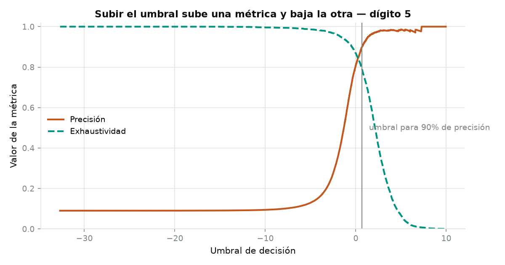
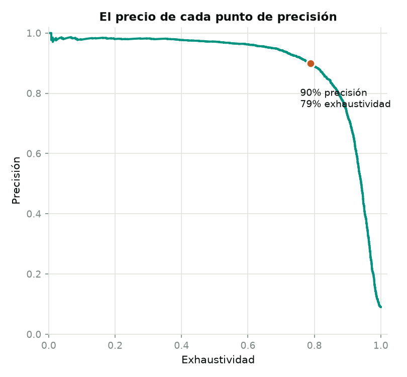
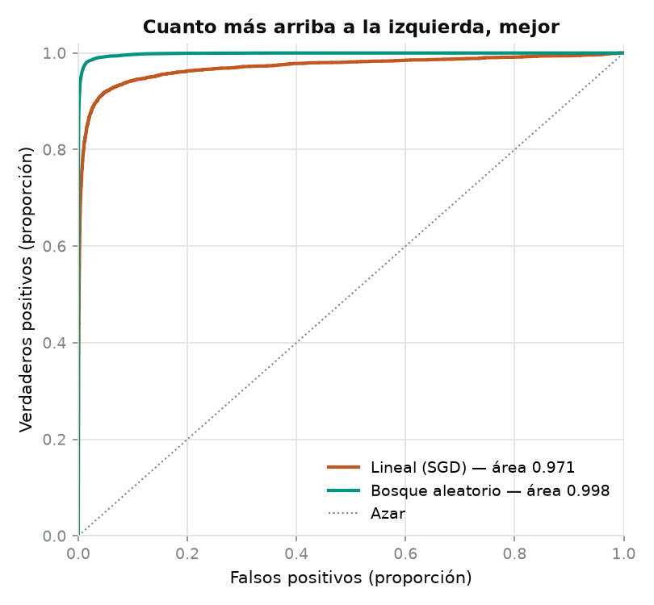

# Capítulo 3 — Clasificación

*Géron, cap. 3 · dataset MNIST*

70,000 dígitos escritos a mano. El objetivo del capítulo **no es clasificarlos**, es
aprender a medir un clasificador — que resulta bastante más resbaladizo que medir una
regresión.

```bash
make data        # descarga MNIST desde OpenML (14 MB)
make features    # partición canónica 60k/10k
make baseline    # detector binario + la trampa de la exactitud
make metrics     # umbral, curvas PR y ROC → reports/
```

---

## La trampa de la exactitud

El primer ejercicio es un detector de una sola cosa: *¿esta imagen es un 5?*

Solo el **9% de las imágenes son cincos**. Así que un modelo que responda "no es un 5"
a todo acierta el 91% de las veces sin haber mirado un solo píxel. `make baseline`
entrena ese modelo tonto a propósito para ponerlo al lado del real:

| | Exactitud |
|---|---|
| Clasificador real (SGD) | 0.9696 |
| Responder siempre «no es 5» | 0.9096 |

**Seis puntos** separan un modelo que aprendió de uno que no hizo nada. Ese es el
motivo por el que la exactitud no sirve cuando una clase es rara — y en la práctica
casi siempre lo es: el fraude, la enfermedad, la falla del equipo.

## Lo que sí distingue

```
                    predijo «no 5»   predijo «5»
    es «no 5»          53,470           1,109   ← falsos positivos
    es «5»                715           4,706
                        ↑ falsos negativos
```

| Métrica | Valor | Qué responde |
|---|---|---|
| Precisión | 0.809 | De lo que llamó 5, ¿cuánto era 5? |
| Exhaustividad | 0.868 | De todos los 5 que había, ¿cuántos encontró? |
| F1 | 0.838 | Media armónica — penaliza el desequilibrio entre ambas |

Todas se calculan con `cross_val_predict`: cada imagen la puntúa un modelo que no la
vio al entrenarse. Medirlas sobre el propio entrenamiento daría números inflados.

---

## El compromiso, y que no tiene solución técnica

Un clasificador no responde sí o no: calcula una puntuación y la compara contra un
umbral. Moverlo desplaza las dos métricas en direcciones opuestas.



Pedirle **90% de precisión** a este modelo cuesta caro:

| | |
|---|---|
| Umbral | +0.69 |
| Precisión | 0.900 |
| Exhaustividad | **0.789** |

Es decir: para equivocarse solo 1 de cada 10 veces que dice "es un 5", tiene que
dejar escapar **1 de cada 5 cincos**.



**Dónde pararse en esa curva no es una decisión técnica.** Un filtro de spam quiere
precisión — mandar un correo importante a la basura es peor que dejar pasar
publicidad. Un detector de tumores quiere exhaustividad — revisar de más es un susto,
pasar uno por alto es otra cosa. Mismo modelo, distinto punto de operación, según lo
que cueste equivocarse.

## Comparar clasificadores sin fijar un umbral



| Modelo | Área bajo la curva |
|---|---|
| Lineal (SGD) | 0.971 |
| Bosque aleatorio | **0.998** |

El área resume el desempeño en todos los umbrales a la vez, así que sirve para
comparar modelos antes de decidir dónde operar.

⚠️ **Cuidado con esta métrica cuando la clase positiva es rara.** La curva ROC usa la
proporción de falsos positivos, y con 54,000 negativos contra 5,400 positivos el
denominador es tan grande que la curva se ve optimista. Para clases desbalanceadas, la
curva de precisión contra exhaustividad cuenta la verdad más incómoda — y por eso
Géron recomienda preferirla en ese caso.

---

## Pendiente del capítulo

- Clasificación multiclase — de «¿es un 5?» a «¿cuál de los diez?»
- Análisis de errores con la matriz de confusión: qué dígitos se confunden entre sí
- Clasificación multietiqueta y multisalida
- Ejercicios: k-vecinos afinado hasta ~97%, aumentar datos desplazando las imágenes,
  el Titanic, y un filtro de spam

## Estructura

| Archivo | Fase |
|---|---|
| `src/data.py` | Descarga desde OpenML, guarda en `uint8` |
| `src/features.py` | Partición canónica 60k/10k, sin barajar |
| `src/baseline.py` | Detector binario, modelo tonto, matriz de confusión |
| `src/metrics.py` | Umbral, curvas PR y ROC |

**Por qué no se baraja la partición:** las 10,000 imágenes de prueba de MNIST son las
mismas desde 1998 y todos los resultados publicados las usan. Además vienen de
personas distintas a las del entrenamiento — empleados del censo contra estudiantes.
Mezclarlas volvería el problema artificialmente fácil.
