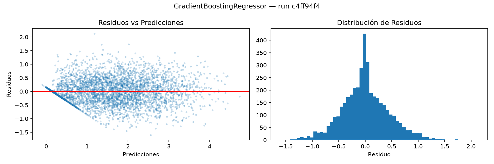

# Evaluación Final — GradientBoostingRegressor

**run_id:** `c4ff94f43c5d42768d0eb84b8bbae4a2`

| Métrica | Valor |
|---------|-------|
| RMSE    | 0.4419 |
| MAE     | 0.3329 |
| R²      | 0.8350 |

> RMSE en unidades originales: USD 44,189 promedio de error por casa.

